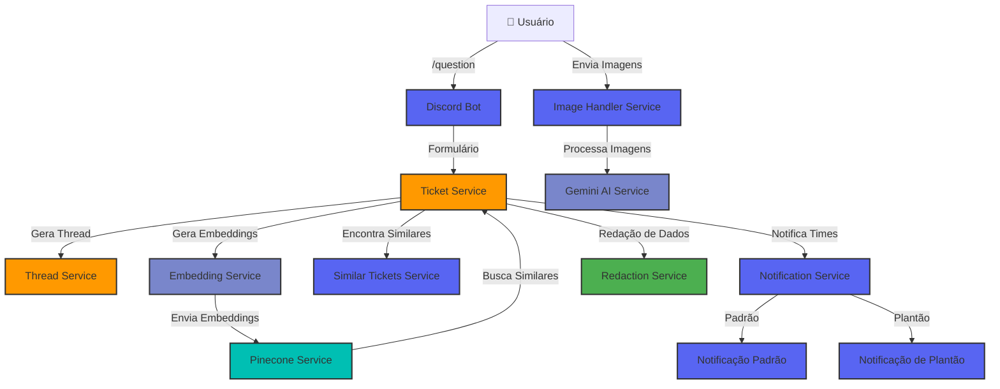

<div align="center">
  
# 🤖 Conformis


**Sistema inteligente de suporte técnico com RAG (Retrieval Augmented Generation) para Discord**

</div>

---

## 📊 Stack

<table>
  <tr>
    <td align="center" width="96">
      
      <br>TypeScript
    </td>
    <td align="center" width="96">
      
      <br>Node.js
    </td>
    <td align="center" width="96">
      
      <br>Discord.js
    </td>
    <td align="center" width="96">
      
      <br>OpenAI
    </td>
    <td align="center" width="96">
      
      <br>Pinecone
    </td>
    <td align="center" width="96">
      
      <br>Gemini
    </td>
  </tr>
</table>

---

## 🌟 Principais Recursos

<div align="center">

| 🎫 **Sistema de Tickets** | 🧠 **IA Contextual** | 🔄 **RAG Integrado** | 🚨 **Notificações por Plantão** |
|:------------------------:|:-------------------:|:------------------:|:----------------------------:|
| Interface completa para abertura e<br>gestão de tickets via Discord | Busca semântica por<br>problemas similares | Embeddings para<br>recuperação de informações | Notificações configuráveis<br>por dia da semana |
| 📝 **Formulários Smart** | 🖼️ **Análise de Imagens** | 🔒 **Proteção de Dados** | 📊 **Insights de Problemas** |
| Formulários estruturados<br>de fácil preenchimento | Descrição automática<br>de screenshots enviados | Redação de informações<br>sensíveis e PII | Resumos gerados por IA<br>para rápida compreensão |

</div>

---

## 📘 Sobre o Projeto

O **Conformis** é uma solução avançada para equipes de suporte técnico que gerenciam incidentes através do Discord. Combinando a acessibilidade e familiaridade da plataforma Discord com tecnologias de IA de ponta (RAG - Retrieval Augmented Generation), o sistema otimiza o fluxo de trabalho de atendimento de problemas técnicos.

### Como Funciona:
1. **Captura Estruturada**: Usuários registram incidentes via formulário detalhado
2. **Processamento Semântico**: O sistema gera embeddings e armazena no Pinecone
3. **Recuperação Inteligente**: Tickets similares são identificados para rápida resolução
4. **Notificação Contextual**: Equipes de plantão são notificadas conforme escala configurada

O sistema não apenas agiliza o processo de registro e resolução de incidentes, mas também preserva o conhecimento organizacional, transformando cada ticket resolvido em uma fonte valiosa para solucionar problemas futuros.

---

## 🛠️ Arquitetura



A arquitetura do sistema é modular e orientada a serviços, com clara separação de responsabilidades:

- **Camada de Interface**: Gerencia todas as interações com o Discord
- **Camada de Serviços**: Implementa a lógica de negócios central
- **Camada de IA**: Integra serviços de OpenAI e Gemini para processamento inteligente
- **Camada de Persistência**: Gerencia vetores no Pinecone para recuperação semântica

---

## 🚀 Instalação e Configuração

### Pré-requisitos

- Node.js 20+
- pnpm ou npm 
- Credenciais das APIs:
  - Discord Bot Token e Client ID
  - OpenAI API Key
  - Pinecone API Key
  - Google Gemini API Key

### Instalação Rápida

```bash
# Clone o repositório
git clone https://github.com/Paulo-Borszcz/conformis.git

# Entre no diretório
cd conformis

# Instale as dependências
pnpm install

# Configure seu ambiente
cp .env.example .env
# Edite o arquivo .env com suas credenciais

# Compile o TypeScript
pnpm build

# Inicie o bot
pnpm start
```

### Configuração Detalhada

Edite o arquivo `.env` com as configurações necessárias:

<table>
<tr>
<th>Categoria</th>
<th>Variável</th>
<th>Descrição</th>
</tr>
<tr>
<td rowspan="4"><b>Discord</b></td>
<td>DISCORD_TOKEN</td>
<td>Token de autenticação do seu bot</td>
</tr>
<tr>
<td>DISCORD_CLIENT_ID</td>
<td>ID da aplicação Discord</td>
</tr>
<tr>
<td>DISCORD_GUILD_ID</td>
<td>ID do servidor principal</td>
</tr>
<tr>
<td>DISCORD_NOTIFICATION_CHANNEL_ID</td>
<td>Canal para notificações gerais</td>
</tr>
<tr>
<td rowspan="5"><b>Plantões</b></td>
<td>SHIFT_NOTIFICATION_GUILD_ID</td>
<td>ID do servidor para notificações de plantão</td>
</tr>
<tr>
<td>SHIFT_CHANNEL_ID_1</td>
<td>Canal para notificações de Segunda-feira</td>
</tr>
<tr>
<td>SHIFT_ROLE_ID_1</td>
<td>Cargo a ser mencionado na Segunda-feira</td>
</tr>
<tr>
<td>SHIFT_CHANNEL_ID_2 ... SHIFT_CHANNEL_ID_7</td>
<td>Canais para os demais dias da semana</td>
</tr>
<tr>
<td>SHIFT_ROLE_ID_2 ... SHIFT_ROLE_ID_7</td>
<td>Cargos a serem mencionados nos demais dias</td>
</tr>
<tr>
<td rowspan="4"><b>APIs</b></td>
<td>OPENAI_API_KEY</td>
<td>Chave da API da OpenAI para embeddings</td>
</tr>
<tr>
<td>PINECONE_API_KEY</td>
<td>Chave da API do Pinecone</td>
</tr>
<tr>
<td>PINECONE_ENVIRONMENT<br>PINECONE_INDEX</td>
<td>Configurações do ambiente e índice Pinecone</td>
</tr>
<tr>
<td>GEMINI_API_KEY</td>
<td>Chave da API do Google Gemini</td>
</tr>
</table>

---

## 📂 Estrutura do Projeto

<details>
<summary><b>Clique para expandir</b></summary>

```
src/
├── app.ts                 # Ponto de entrada da aplicação
├── bot.ts                 # Configuração principal do bot
├── commands/              # Comandos slash do Discord
│   └── question.ts        # Comando para abrir o modal de ticket
├── constants/             # Constantes do projeto
├── events/                # Handlers de eventos do Discord
├── models/                # Modelos de dados
│   ├── Ticket.ts          # Modelo de ticket e formulário
│   └── User.ts            # Modelo de usuário
├── services/              # Serviços principais
│   ├── DiscordService.ts  # Orquestrador de serviços do Discord
│   ├── EmbeddingService.ts # Geração de embeddings via OpenAI
│   ├── GeminiService.ts   # Integração com a API do Gemini
│   ├── ImageDescriptionService.ts # Descrição de imagens
│   ├── PineconeService.ts # Armazenamento e busca de vetores
│   ├── RedactionService.ts # Proteção de dados sensíveis
│   ├── TicketService.ts   # Orquestrador de tickets
│   └── discord/           # Serviços específicos do Discord
│       ├── ImageHandlerService.ts  # Processamento de imagens
│       ├── ModalService.ts # Criação de modais
│       ├── NotificationService.ts  # Orquestrador de notificações
│       ├── NotificationServices/   # Implementações específicas
│       ├── SimilarTicketsService.ts # Tickets similares
│       ├── ThreadService.ts # Gerenciamento de threads
│       └── TicketFormHelper.ts # Helpers para formulários
├── types/                 # Definições de tipos TypeScript
└── utils/                 # Utilitários diversos
    ├── config.ts          # Configurações da aplicação
    ├── inviteUrl.ts       # Gerador de URL de convite
    ├── logger.ts          # Sistema de logging
    └── similarity.ts      # Funções de cálculo de similaridade
```
</details>

---

## 📱 Guia de Uso

<div align="center">
<h3>👨‍💻 Para Usuários</h3>
</div>

<table>
<tr>
<td align="center" style="background-color: #f0f8ff; border-radius: 10px; padding: 20px;">

<br><br>
<h4>Fluxo de Abertura de Ticket</h4>
<br>
<table>
<tr>
<td align="center" style="background-color: #e6f7ff; border-radius: 8px; padding: 15px; width: 33%;">

<br>
<b>1. Inicie com /question</b>
<br>
Digite o comando no canal de suporte
</td>
<td align="center" style="background-color: #e6f7ff; border-radius: 8px; padding: 15px; width: 33%;">

<br>
<b>2. Preencha o formulário</b>
<br>
Detalhe seu problema técnico
</td>
<td align="center" style="background-color: #e6f7ff; border-radius: 8px; padding: 15px; width: 33%;">

<br>
<b>3. Acompanhe a thread</b>
<br>
Veja tickets similares e respostas
</td>
</tr>
</table>
<br>
<b>Dicas para usuários:</b>
<ul align="left" style="padding-left: 20px; margin-top: 5px;">
<li>Forneça descrições detalhadas para melhorar a precisão das sugestões</li>
<li>Anexe screenshots relevantes para análise automática via IA</li>
<li>Verifique tickets similares antes de abrir novos para problemas recorrentes</li>
</ul>
</td>
</tr>
</table>

<br>

<div align="center">
<h3>⚙️ Para Administradores</h3>
</div>

<table>
<tr>
<td align="center" style="background-color: #f0f8ff; border-radius: 10px; padding: 20px;">

<br><br>
<h4>Ferramentas de Gestão</h4>
<br>
<table>
<tr>
<td align="center" style="background-color: #e6f7ff; border-radius: 8px; padding: 15px; width: 50%;">

<br>
<b>Configuração de Plantões</b>
<br>
<ul align="left" style="padding-left: 15px; margin-top: 5px;">
<li>Configure canais e cargos para cada dia no <code>.env</code></li>
<li>Verifique permissões do bot em todos os canais</li>
<li>Teste notificações com <code>/test-shift</code></li>
</ul>
</td>
<td align="center" style="background-color: #e6f7ff; border-radius: 8px; padding: 15px; width: 50%;">

<br>
<b>Monitoramento de Tickets</b>
<br>
<ul align="left" style="padding-left: 15px; margin-top: 5px;">
<li>Acompanhe o canal principal de notificações</li>
<li>Verifique threads abertas para tickets não resolvidos</li>
<li>Use <code>/status</code> para estatísticas atuais</li>
</ul>
</td>
</tr>
</table>
<br>
<b>Comandos administrativos:</b>
<pre style="text-align: left; background-color: #282c34; color: #abb2bf; padding: 10px; border-radius: 5px; margin: 10px 20px;">
/status         - Verifica status operacional do bot
/shift-config   - Configura escala de plantão
/mark-solved    - Marca ticket como resolvido (melhora IA)
/clear-cache    - Reinicia cache de embeddings
/block-user     - Bloqueia usuário por mau uso
</pre>
</td>
</tr>
</table>

---

## 🔜 Em Breve

<div align="center">
<table>
<tr>
<th>Recurso</th>
<th>Descrição</th>
<th>Prioridade</th>
</tr>
<tr>
<td><b>🔍 Visualização de Similaridade</b></td>
<td>Comando <code>/similarity-graph</code> para gerar gráficos de visualização usando algoritmo de vizinho mais próximo (k-NN) baseado nos embeddings existentes</td>
<td>Alta</td>
</tr>
<tr>
<td><b>📊 Estatísticas de Tickets</b></td>
<td>Dashboard com métricas essenciais como tempo de resolução médio, categorias mais comuns e carga por equipe</td>
<td>Média</td>
</tr>
<tr>
<td><b>🔄 Integração com Jira e ClickUp</b></td>
<td>Sincronização bidirecional entre tickets do Discord e issues do Jira e cards do ClickUp</td>
<td>Média</td>
</tr>
<tr>
<td><b>🧪 Treinamento Contínuo</b></td>
<td>Pipeline de fine-tuning para modelos de embeddings baseado em dados históricos de tickets</td>
<td>Baixa</td>
</tr>
<tr>
<td><b>🌍 Suporte Multilíngue</b></td>
<td>Detecção e processamento automático de tickets em diferentes idiomas</td>
<td>Baixa</td>
</tr>
</table>
</div>

### Detalhes da Visualização de Similaridade

O recurso de visualização de similaridade utilizará algoritmos de vizinho mais próximo (k-NN) para construir gráficos interativos que mostram como os tickets se relacionam entre si no espaço vetorial. A implementação incluirá:

- **Tecnologias**: D3.js para visualização, ScikitLearn ou UMAP para processamento
- **Interfaces**:
  - Gráfico de rede para visualizar clusters de tickets similares
  - Mapa de calor para identificar áreas de alta concentração de problemas
  - Visualização temporal para acompanhar a evolução de categorias de tickets

- **Comando Discord**: `/similarity-graph [dias:30] [tickets:100] [algoritmo:umap]`
- **Opções de Exportação**: PNG, SVG e PDF para relatórios

Este recurso ajudará as equipes de suporte a identificar padrões recorrentes e oportunidades de documentação proativa, além de prever possíveis surtos de certos tipos de problemas.

---

## 🔒 Segurança e Privacidade

O sistema implementa várias camadas de proteção:

- **Redação Automática**: Identificação e ofuscação de CPFs, cartões de crédito e endereços
- **Separação de Responsabilidades**: Armazenamento de vetores separado de dados pessoais
- **Logging Inteligente**: Sistema de logs que não persiste informações sensíveis

<table>
<tr>
<th>Tipo de Dado</th>
<th>Método de Proteção</th>
</tr>
<tr>
<td>CPF</td>
<td>Substituição por <code>[REDACTED_CPF]</code></td>
</tr>
<tr>
<td>Cartão de Crédito</td>
<td>Substituição por <code>[REDACTED_CREDIT_CARD]</code></td>
</tr>
<tr>
<td>Endereços</td>
<td>Substituição por <code>[REDACTED_ADDRESS]</code></td>
</tr>
</table>

---

## 🧑‍💻 Desenvolvimento e Contribuição

### Fluxo de Desenvolvimento

```bash
pnpm run dev

pnpm run build

pnpm run lint
```

### Como Contribuir

1. Faça um fork do repositório
2. Crie um branch para sua feature (`git checkout -b feature/nova-funcionalidade`)
3. Faça commit das suas alterações (`git commit -am 'Adiciona nova funcionalidade'`)
4. Push para o branch (`git push origin feature/nova-funcionalidade`)
5. Crie um Pull Request

### Prioridades de Desenvolvimento

- [ ] Implementação de dashboard web para monitoramento
- [ ] Integração com sistemas de ticketing externos (Jira, ServiceNow)
- [ ] Análise de sentimento para priorização automática
- [ ] Tradução multilíngue para suporte global
- [ ] Estatísticas e métricas de resolução de tickets

---

<div align="center">

## 📊 Métricas e Monitoramento

</div>

O sistema gera logs detalhados usando Winston, permitindo:

- **Métricas Operacionais**: Tempo de resposta, taxa de resolução
- **Insights de Uso**: Tipos de problemas mais comuns, eficácia de resoluções
- **Alertas de Problemas**: Notificações quando o sistema encontra erros 

<div align="center">

```
[2023-05-15T14:23:45.123Z] INFO: Bot online! Logado como RAGSupportBot#1234
[2023-05-15T14:24:01.456Z] INFO: Ticket c82a6df processado com sucesso para usuário 123456789
[2023-05-15T14:24:02.789Z] INFO: Encontrados 3 tickets similares para o ticket c82a6df
```

</div>

---

<div align="center">


**Desenvolvido por Paulo Felipe Borszcz**

<br>

<p>
<a href="https://github.com/Paulo-Borszcz"></a>
<a href="https://www.linkedin.com/in/paulo-borszcz/"></a>
</p>

</div>
